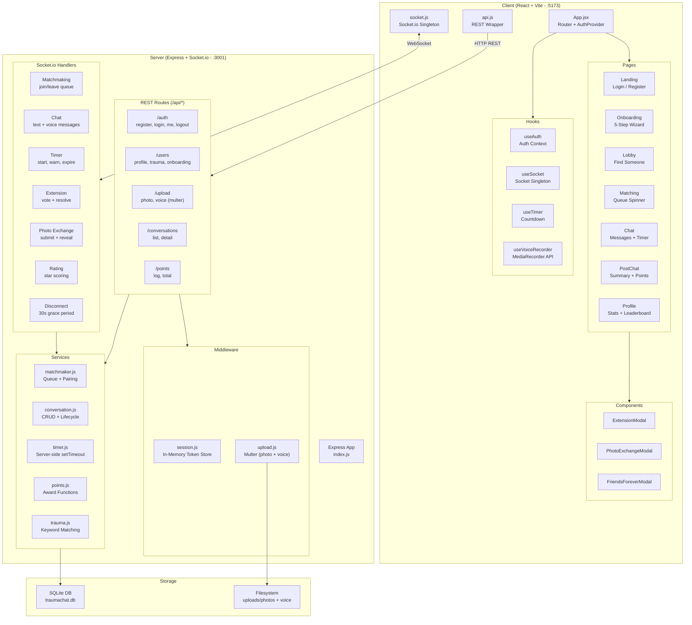
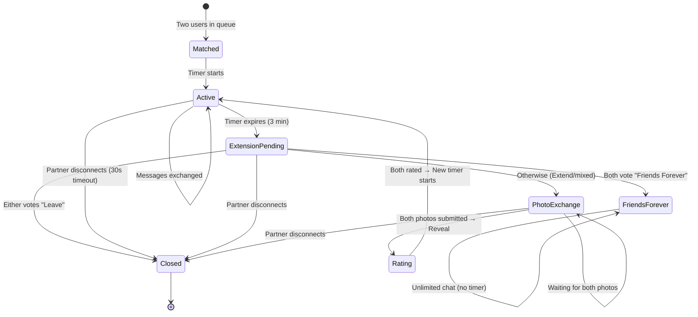
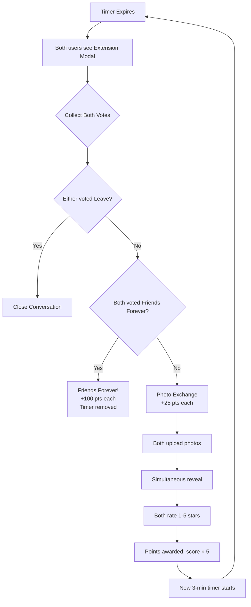
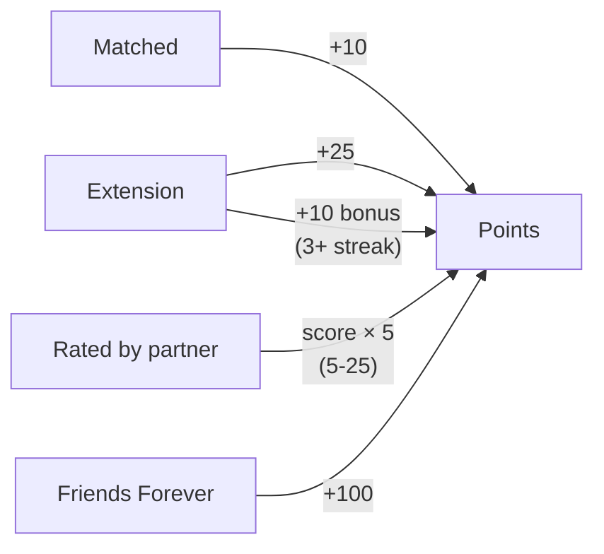
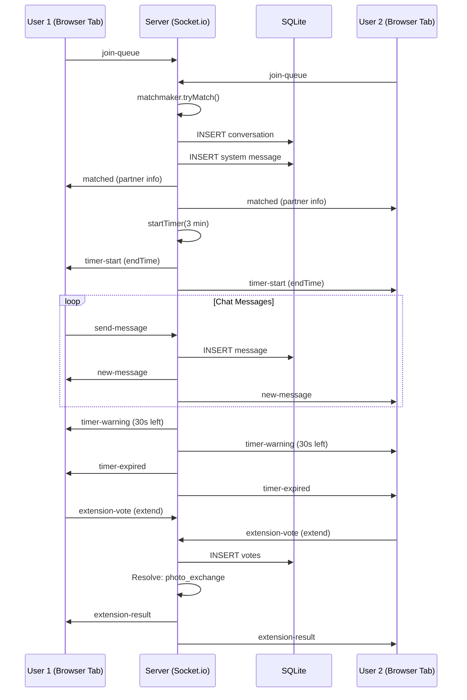
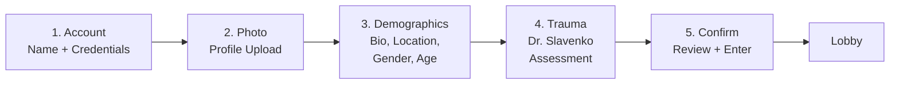
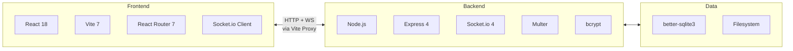

# TraumaChat Architecture

## System Overview

## Conversation State Machine

## Extension Voting Logic

## Points System Flow

## Data Flow: Real-Time Chat

## Onboarding Flow

## Tech Stack

